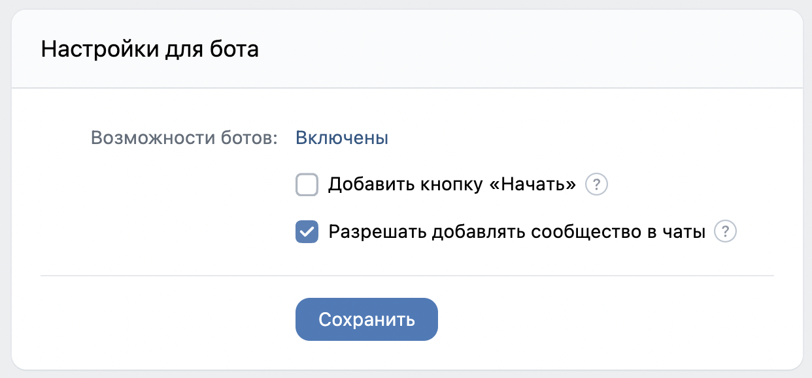
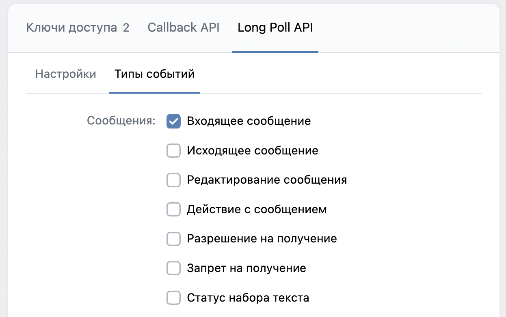

# VK Unsilence

## Что это?
Мы столкнулись с ситуацией, когда человек отправляет голосовое сообщение
в общий чат, и молчит в нем половину его времени.

Проблема решена. Время на прослушивание тишины больше не тратится, а исходный
код лежит здесь. Разумеется, проект шуточный и использует супер странные решения с
технической стороны. Серьёзно смотреть на него запрещено.


Под капотом бот использует CLI версию проекта [Unsilence](https://github.com/lagmoellertim/unsilence).
Может работать в Swarm и Compose режимах.

## Как запустить?

Вам необходим [Docker](https://docs.docker.com/get-docker/) и docker-compose.

Создайте сообщество VK, получите ключ доступа с правами сообщений, включите сообщения, возможности для 
ботов, разрешите добавлять сообщество в беседы и включите Long Poll API последней версии с событием
*Входящее сообщение*.




На локальной машине рекомендуется запуск с Compose.

### Для запуска в Compose

Переименуйте `example.env` в `.env`.

В файле `.env` замените поле `TOKEN` на тот ключ доступа, что вы получили в настройках сообщества VK.
Поле `ADMIN_ID` замените на ваш userId в VK.

Запуск в Compose режиме:
```shell
$ docker-compose up --build
```

### Для запуска в Swarm

Переименуйте `example.secrets.yml` в `secrets.yml`.

В файле `secrets.yml` замените поле `token` на тот ключ доступа, что вы получили в настройках сообщества VK. 
Поле `adminId` замените на ваш userId в VK.

Далее создайте секреты:
```shell
$ docker secret create vk-unsilence-secrets secrets.yml
```

Запуск в Swarm режиме:
```shell
$ docker stack deploy -c docker-compose.stage.yml vk-unsilence
```
